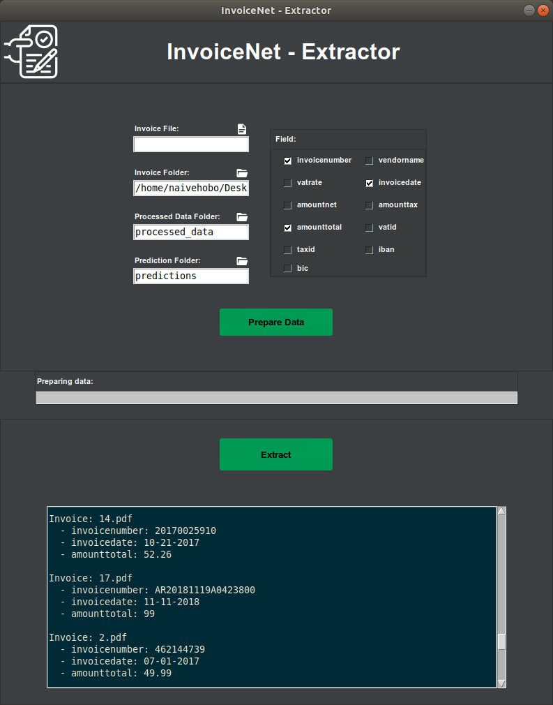

# InvoiceNet
Deep neural network to extract intelligent information from PDF invoice documents.

Trainer             |  Extractor
:-------------------------:|:-------------------------:
  |  

## Installation
To install InvoiceNet, run the following commands:
```
git clone https://github.com/naiveHobo/InvoiceNet.git
cd InvoiceNet/

# Run installation script
./install.sh
```
The install.sh script will install all the dependencies, create a virtual environment, and install InvoiceNet in the virtual environment.

To be able to use InvoiceNet, you need to source the virtual environment that the package was installed in.
```
# Source virtual environment
source env/bin/activate
```

## Data Preparation
Your training data should be in the following format:

```
train_data/
    invoice1.pdf
    invoice1.json
    invoice2.pdf
    invoice2.json
    ...
```

The JSON labels should have the following format:
```
{
 "vendorname":"Hetzner Online GmbH",
 "invoicedate":"12-01-2017",
 "invoicenumber":"R0007546449",
 "amounttotal":"137.51",
 ... other fields
}
```

To begin the data preparation process, click on the "Prepare Data" button in the GUI or follow the instructions below if you're using the CLI.


## Add Your Own Fields
To add your own fields to InvoiceNet, open **invoicenet/\_\_init\_\_.py**.

There are 4 pre-defined field types:
- **FIELD_TYPES["general"]** : General field like names, address, invoice number, etc.
- **FIELD_TYPES["optional"]** : Optional fields that might not be present in all invoices.
- **FIELD_TYPES["amount"]** : Fields that represent an amount.
- **FIELD_TYPES["date"]** : Fields that represent a date.

Choose the appropriate field type for the field and add the line mentioned below.

```
# Add the following line at the end of the file

# For example, to add a field totalamount
FIELDS["totalamount"] = FIELD_TYPES["amount"]

# For example, to add a field invoicedate
FIELDS["invoicedate"] = FIELD_TYPES["date"]

# For example, to add a field taxid (which might be optional)
FIELDS["taxid"] = FIELD_TYPES["optional"]

# For example, to add a field vendorname
FIELDS["vendorname"] = FIELD_TYPES["general"]
```


## Using the GUI
InvoiceNet provides you with a GUI to train a model on your data and extract information from invoice documents using this trained model

Run the following command to run the trainer GUI:

```
python trainer.py
```

Run the following command to run the extractor GUI:

```
python extractor.py
```

You need to prepare the data for training and extraction first. 
You can do so by setting the **Data Folder** field to the directory containing your training/prediction data and the clicking the **Prepare Data** button.
Once the data is prepared, you can start training/prediction by clicking the **Start** button.


## Using the CLI

### Training 

Prepare the data for training first by running the following command:
```
python prepare_data.py --data_dir train_data/
```

Train InvoiceNet using the following command:
```
python train.py --field enter-field-here --batch_size 8

# For example, for field 'amounttotal'
python train.py --field amounttotal --batch_size 8
```

---

### Prediction

---

#### Single invoice
To extract a field from a single invoice file, run the following command:

```
python predict.py --field enter-field-here --invoice path-to-invoice-file

# For example, to extract field totalamount from an invoice file invoices/1.pdf
python predict.py --field totalamount --invoice invoices/1.pdf
```

---

#### Multiple invoices
For extracting information using the trained InvoiceNet model, you just need to place the PDF invoice documents in one directory in the following format:

```
predict_data/
    invoice1.pdf
    invoice2.pdf
    ...
```

Prepare the data for prediction first by running the following command:
```
python prepare_data.py --data_dir predict_data/ --prediction 
```

Run InvoiceNet using the following command:
```
python predict.py --field enter-field-here

# For example, for field 'amounttotal'
python predict.py --field amounttotal
```
---

## Reference
This implementation is largely based on the work of R. Palm et al, who should be cited if this is used in a scientific publication (or the preceding conference papers):

[1] Palm, Rasmus Berg, Florian Laws, and Ole Winther. "Attend, Copy, Parse End-to-end information extraction from documents." 2019 International Conference on Document Analysis and Recognition (ICDAR). IEEE, 2019.

```
@inproceedings{palm2019attend,
  title={Attend, Copy, Parse End-to-end information extraction from documents},
  author={Palm, Rasmus Berg and Laws, Florian and Winther, Ole},
  booktitle={2019 International Conference on Document Analysis and Recognition (ICDAR)},
  pages={329--336},
  year={2019},
  organization={IEEE}
}
```
