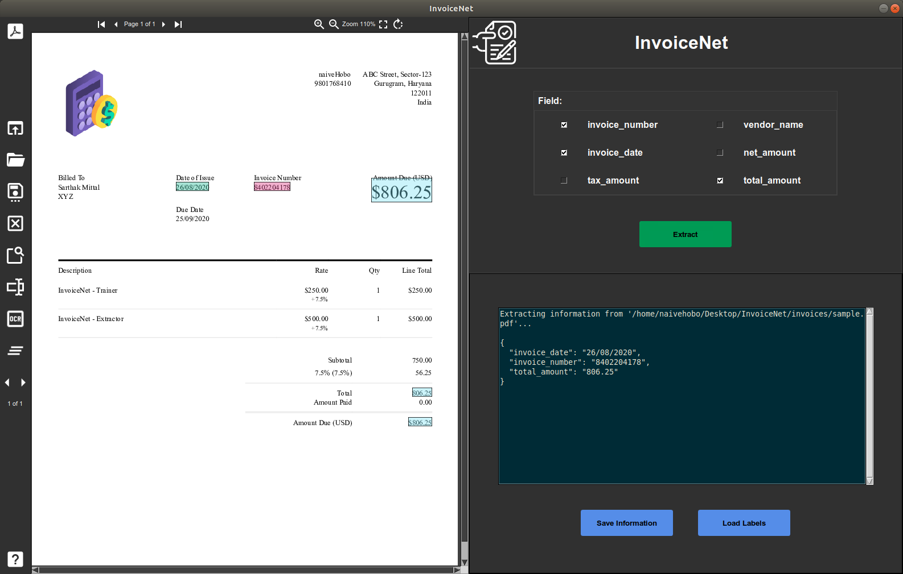
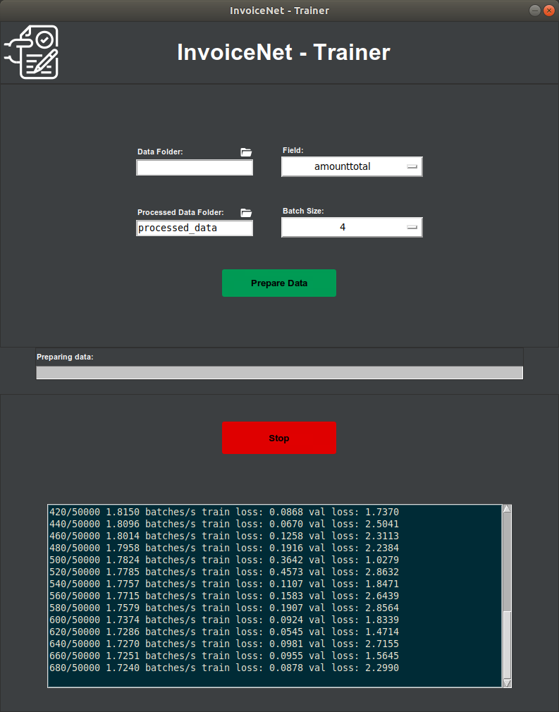

--------------------------------------------------------------------------------

Deep neural network to extract intelligent information from invoice documents.

**TL;DR**

* An easy to use UI to view PDF/JPG/PNG invoices and extract information.
* Train custom models using the Trainer UI on your own dataset.
* Add or remove invoice fields as per your convenience.
* Save the extracted information into your system with the click of a button.

:star: We appreciate your star, it helps!

The InvoiceNet logo was designed by [Sidhant Tibrewal](https://www.linkedin.com/in/sidhant-tibrewal-864058148/).
[Check out](https://www.behance.net/tiber_sid) his work for some more beautiful designs.

---



---

**DISCLAIMER**: 

Pre-trained models for some general invoice fields are not available right now but will soon be provided.
The training GUI and data preparation scripts have been made available.

Invoice documents contain sensitive information because of which collecting a sizable dataset has proven to be difficult.
This makes it difficult for developers like us to train large-scale generalised models and make them available to the community.

If you have a dataset of invoice documents that you are comfortable sharing with us, please reach out (<sarthakmittal2608@gmail.com>).
We have the tools to create the first publicly-available large-scale invoice dataset along with a software platform for structured information extraction.

---

## Installation

#### Ubuntu 18.04 and 20.04

To install InvoiceNet on Ubuntu, run the following commands:

```bash
git clone https://github.com/naiveHobo/InvoiceNet.git
cd InvoiceNet/

# Run installation script
./install.sh
```

The install.sh script will install all the dependencies, create a virtual environment, and install InvoiceNet in the virtual environment.

To be able to use InvoiceNet, you need to source the virtual environment that the package was installed in.

```bash
# Source virtual environment
source env/bin/activate
```

#### Windows 10

The recommended way is to install InvoiceNet along with its dependencies in an Anaconda environment:

```bash
git clone https://github.com/naiveHobo/InvoiceNet.git
cd InvoiceNet/

# Create conda environment and activate
conda create --name invoicenet python=3.7
conda activate invoicenet

# Install InvoiceNet
pip install .

# Install poppler
conda install -c conda-forge poppler
```

Some dependencies also need to be installed separately on Windows 10 before running InvoiceNet:

- [Tesseract 5.0.0](https://github.com/UB-Mannheim/tesseract/wiki)
- [ImageMagick 7.0.10](https://imagemagick.org/script/download.php#windows)
- [Ghostscript 9.52](https://www.ghostscript.com/download/gsdnld.html)


## Data Preparation
The training data must be arranged in a single directory. The invoice documents are expected be PDF files and each invoice is expected to have a corresponding JSON label file with the same name. Your training data should be in the following format:

```
train_data/
    invoice1.pdf
    invoice1.json
    nike-invoice.pdf
    nike-invoice.json
    12345.pdf
    12345.json
    ...
```

The JSON labels should have the following format:
```
{
 "vendor_name":"Nike",
 "invoice_date":"12-01-2017",
 "invoice_number":"R0007546449",
 "total_amount":"137.51",
 ... other fields
}
```

To begin the data preparation process, click on the "Prepare Data" button in the GUI or follow the instructions below if you're using the CLI.


## Add Your Own Fields
To add your own fields to InvoiceNet, open **invoicenet/\_\_init\_\_.py**.

There are 4 pre-defined field types:
- **FIELD_TYPES["general"]** : General field like names, address, invoice number, etc.
- **FIELD_TYPES["optional"]** : Optional fields that might not be present in all invoices.
- **FIELD_TYPES["amount"]** : Fields that represent an amount.
- **FIELD_TYPES["date"]** : Fields that represent a date.

Choose the appropriate field type for the field and add the line mentioned below.

```python
# Add the following line at the end of the file

# For example, to add a field total_amount
FIELDS["total_amount"] = FIELD_TYPES["amount"]

# For example, to add a field invoice_date
FIELDS["invoice_date"] = FIELD_TYPES["date"]

# For example, to add a field tax_id (which might be optional)
FIELDS["tax_id"] = FIELD_TYPES["optional"]

# For example, to add a field vendor_name
FIELDS["vendor_name"] = FIELD_TYPES["general"]
```


## Using the GUI
InvoiceNet provides you with a GUI to train a model on your data and extract information from invoice documents using this trained model




Run the following command to run the trainer GUI:

```bash
python trainer.py
```

Run the following command to run the extractor GUI:

```bash
python extractor.py
```

You need to prepare the data for training first. 
You can do so by setting the **Data Folder** field to the directory containing your training data and the clicking the **Prepare Data** button.
Once the data is prepared, you can start training by clicking the **Start** button.


## Using the CLI

### Training 

Prepare the data for training first by running the following command:
```bash
python prepare_data.py --data_dir train_data/
```

Train InvoiceNet using the following command:
```bash
python train.py --field enter-field-here --batch_size 8

# For example, for field 'total_amount'
python train.py --field total_amount --batch_size 8
```

---

### Prediction
If you are trying to use different ocr, change the ocr_engine in this function before running predict.py [create_ngrams.py](https://github.com/naiveHobo/InvoiceNet/blob/e883158a690726afd1de5b76b5810287013577c6/invoicenet/common/util.py#L193)

---

#### Single invoice
To extract a field from a single invoice file, run the following command:
```bash
python predict.py --field enter-field-here --invoice path-to-invoice-file

# For example, to extract field total_amount from an invoice file invoices/1.pdf
python predict.py --field total_amount --invoice invoices/1.pdf
```

---

#### Multiple invoices
For extracting information using the trained InvoiceNet model, you just need to place the PDF invoice documents in one directory in the following format:

```
predict_data/
    invoice1.pdf
    invoice2.pdf
    ...
```

Run InvoiceNet using the following command:
```bash
python predict.py --field enter-field-here --data_dir predict_data/

# For example, for field 'total_amount'
python predict.py --field total_amount --data_dir predict_data/
```
---

## Reference
This implementation is largely based on the work of R. Palm et al, who should be cited if this is used in a scientific publication (or the preceding conference papers):

[1] Palm, Rasmus Berg, Florian Laws, and Ole Winther. **"Attend, Copy, Parse End-to-end information extraction from documents."** 2019 International Conference on Document Analysis and Recognition (ICDAR). IEEE, 2019.

```bibtex
@inproceedings{palm2019attend,
  title={Attend, Copy, Parse End-to-end information extraction from documents},
  author={Palm, Rasmus Berg and Laws, Florian and Winther, Ole},
  booktitle={2019 International Conference on Document Analysis and Recognition (ICDAR)},
  pages={329--336},
  year={2019},
  organization={IEEE}
}
```

### Note
An implementation of an inferior (also slightly broken) invoice handling system based on the paper **"Cloudscan - A configuration-free invoice analysis system using recurrent neural networks."** is available [here](https://github.com/naiveHobo/InvoiceNet/tree/cloudscan).

[2] Palm, Rasmus Berg, Ole Winther, and Florian Laws. **"Cloudscan - A configuration-free invoice analysis system using recurrent neural networks."** 2017 14th IAPR International Conference on Document Analysis and Recognition (ICDAR). Vol. 1. IEEE, 2017.

```bibtex
@inproceedings{palm2017cloudscan,
  title={Cloudscan-a configuration-free invoice analysis system using recurrent neural networks},
  author={Palm, Rasmus Berg and Winther, Ole and Laws, Florian},
  booktitle={2017 14th IAPR International Conference on Document Analysis and Recognition (ICDAR)},
  volume={1},
  pages={406--413},
  year={2017},
  organization={IEEE}
}
```
